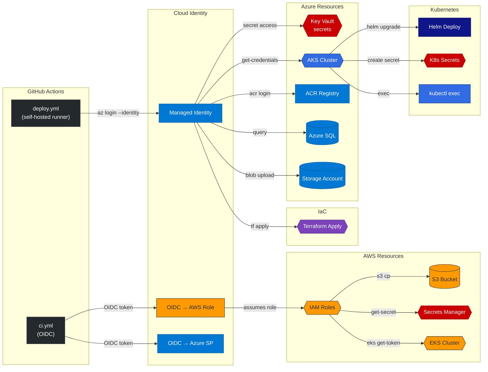
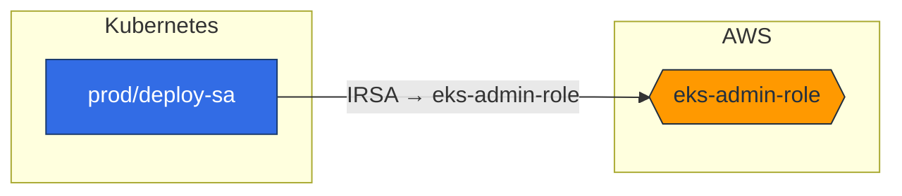

<div align="center">

# 🔍 NHInsight

**Discover risky non-human identities and privilege paths across AWS, Azure, GCP, GitHub, and Kubernetes.**

[](https://github.com/cvemula1/NHInsight/actions/workflows/ci.yml)
[](https://pypi.org/project/nhinsight/)
[](https://hub.docker.com/r/chvemula/nhinsight)
[](LICENSE)
[](https://github.com/cvemula1/NHInsight)

</div>

## Quick Start

```bash
pip install nhinsight          # install from PyPI
nhinsight demo                 # see it in action (no credentials needed)
```

> **Try it in 30 seconds** — `nhinsight demo` runs with built-in sample data so you can see findings, attack paths, and risk scores instantly.

### Scan a real environment

```bash
# Single provider
nhinsight scan --aws

# Multi-provider with attack path analysis
nhinsight scan --all --attack-paths

# CI/CD workflow scanning (no cloud creds required)
nhinsight scan --github-workflows .github/workflows --attack-paths

# Docker (zero install)
docker run --rm chvemula/nhinsight demo
```

### Example: Identity Risk Findings

```
  🔴 CRITICAL — deploy-bot (iam_user, aws)
  │  Has AdministratorAccess policy attached

  🔴 CRITICAL — terraform-deployer (gcp_service_account, gcp)
  │  Service account has roles/owner

  � HIGH — aks-cluster-sp (azure_sp, azure)
  │  SP has Contributor at subscription scope

  🟡 MEDIUM — ci-runner-mi (managed_identity, azure)
  │  Self-hosted runner MI accesses Key Vault + AKS + ACR
```

### Example: Attack Path Detection

```
  ⚡ CRITICAL  blast=86  github → azure → kubernetes
  MI → Azure (PR Deploy to Dev) → Key Vault (secret access)
  → AKS Cluster (get-credentials) → K8s Secret (create)
  Recommendation: Scope MI to least-privilege. Add environment protection rules.

  ⚡ CRITICAL  blast=83  github → iac
  MI → Azure (Deploy Infra) → Terraform (infra apply)
  Recommendation: Restrict runner identity to read-only. Use plan-only in PRs.

  Summary: 31 attack paths across 43 workflows, 222 resource accesses detected
```

## What It Finds

- Overprivileged service accounts and roles (admin, owner, contributor)
- Stale or unrotated credentials (access keys, SA keys, app secrets)
- Wildcard trust relationships and open role assumptions
- Dangerous Kubernetes service account bindings (cluster-admin, legacy tokens)
- Risky GitHub deploy keys, app permissions, and admin-scoped tokens
- **GitHub Actions CI/CD risks** — OIDC misconfigurations, Managed Identity abuse, self-hosted runner exposure
- **Cloud resource access from workflows** — Key Vault, ACR, AKS, Storage, SQL, Terraform, Helm, and 40+ resource patterns
- Cross-cloud attack paths from entry points to privileged resources

**34 risk checks** across 5 providers. [See all risk codes](#risk-codes).

## Supported Providers

- **AWS** — IAM users, roles, access keys, policies, MFA, trust relationships
- **Azure** — Service principals, managed identities, app secrets/certs, RBAC
- **GCP** — Service accounts, SA keys, project IAM bindings
- **GitHub** — Apps, deploy keys, webhooks, permissions
- **Kubernetes** — ServiceAccounts, RBAC, Secrets, IRSA/Workload Identity

## Key Capabilities

- **Attack path analysis** — cross-cloud identity chains with blast radius scoring
- **NIST SP 800-53 scoring** — compliance mapping with letter grades
- **IGA governance scores** — ownership, rotation, least-privilege hygiene
- **AI explanations** — optional OpenAI-powered risk summaries (`--explain`)
- **SARIF output** — plug into GitHub Security tab or CI/CD (`-f sarif`)
- **Zero agents** — read-only API calls, nothing installed in your infra

## Install Options

```bash
pip install nhinsight              # Core (AWS included by default)
pip install nhinsight[all]         # All 5 providers + AI explanations
pip install nhinsight[azure]       # Just Azure
pip install nhinsight[gcp,k8s]     # Mix and match
```

<details>
<summary><b>Docker examples</b></summary>

```bash
# Scan AWS
docker run --rm -e AWS_ACCESS_KEY_ID -e AWS_SECRET_ACCESS_KEY \
  chvemula/nhinsight scan --aws

# Scan Azure
docker run --rm \
  -e AZURE_TENANT_ID -e AZURE_CLIENT_ID \
  -e AZURE_CLIENT_SECRET -e AZURE_SUBSCRIPTION_ID \
  chvemula/nhinsight scan --azure

# Scan GCP
docker run --rm -e GCP_PROJECT=my-project \
  -v ~/.config/gcloud:/root/.config/gcloud:ro \
  chvemula/nhinsight scan --gcp

# Scan Kubernetes
docker run --rm -v ~/.kube/config:/root/.kube/config:ro \
  chvemula/nhinsight scan --k8s

# Scan GitHub
docker run --rm -e GITHUB_TOKEN \
  chvemula/nhinsight scan --github --github-org acme-corp

# Multi-provider + JSON
docker run --rm -e AWS_ACCESS_KEY_ID -e AWS_SECRET_ACCESS_KEY \
  -e GCP_PROJECT=my-project -v ~/.config/gcloud:/root/.config/gcloud:ro \
  chvemula/nhinsight scan --aws --gcp --attack-paths -f json
```

</details>

## Authentication

NHInsight uses **read-only** access via each provider's standard SDK credentials. No agents, no custom auth.

| Provider | Quick Auth |
|----------|-----------|
| **AWS** | `aws configure` or env vars or instance role |
| **Azure** | `az login` or service principal env vars |
| **GCP** | `gcloud auth application-default login` or SA key |
| **GitHub** | `export GITHUB_TOKEN=ghp_...` |
| **Kubernetes** | Uses `~/.kube/config` current context |

<details>
<summary><b>Detailed auth setup per provider</b></summary>

### AWS

Uses the standard [boto3 credential chain](https://boto3.amazonaws.com/v1/documentation/api/latest/guide/credentials.html):

| Method | How |
|--------|-----|
| **Environment variables** | `AWS_ACCESS_KEY_ID` + `AWS_SECRET_ACCESS_KEY` |
| **Named profile** | `export AWS_PROFILE=prod` or `--aws-profile prod` |
| **Instance role / ECS task role** | Automatic on EC2/ECS/Lambda |
| **SSO** | `aws sso login --profile prod` then `--aws-profile prod` |

```bash
# Minimum IAM permissions needed (read-only):
# iam:ListUsers, iam:ListRoles, iam:ListAccessKeys,
# iam:ListMFADevices, iam:GetLoginProfile,
# iam:ListUserPolicies, iam:ListAttachedUserPolicies,
# iam:ListRolePolicies, iam:ListAttachedRolePolicies,
# iam:GetAccessKeyLastUsed

nhinsight scan --aws
nhinsight scan --aws --aws-profile prod --aws-region us-east-1
```

### Azure

Uses [Azure Identity](https://learn.microsoft.com/en-us/python/api/azure-identity/) `DefaultAzureCredential`:

| Method | How |
|--------|-----|
| **Azure CLI** | `az login` (simplest for local dev) |
| **Service Principal** | `AZURE_CLIENT_ID` + `AZURE_CLIENT_SECRET` + `AZURE_TENANT_ID` |
| **Managed Identity** | Automatic on Azure VMs/AKS/Functions |
| **Environment variables** | `AZURE_TENANT_ID` + `AZURE_SUBSCRIPTION_ID` |

```bash
# Required API permissions:
# Microsoft Graph: Application.Read.All, Directory.Read.All
# Azure RBAC: Microsoft.Authorization/roleAssignments/read

az login
nhinsight scan --azure
nhinsight scan --azure --azure-tenant-id TENANT --azure-subscription-id SUB
```

### GCP

Uses [Google Application Default Credentials (ADC)](https://cloud.google.com/docs/authentication/application-default-credentials):

| Method | How |
|--------|-----|
| **gcloud CLI** | `gcloud auth application-default login` (simplest for local dev) |
| **Service Account key** | `export GOOGLE_APPLICATION_CREDENTIALS=/path/to/key.json` |
| **Workload Identity** | Automatic on GKE/Cloud Run/Cloud Functions |
| **Environment variable** | `export GCP_PROJECT=my-project` or `--gcp-project my-project` |

```bash
# Required IAM roles (read-only):
# roles/iam.serviceAccountViewer (list SAs + keys)
# roles/resourcemanager.projectIamViewer (read IAM policy)

gcloud auth application-default login
nhinsight scan --gcp --gcp-project my-project
```

### GitHub

Uses a [Personal Access Token](https://docs.github.com/en/authentication/keeping-your-account-and-data-secure/managing-your-personal-access-tokens) or GitHub App token:

| Method | How |
|--------|-----|
| **PAT (classic)** | `export GITHUB_TOKEN=ghp_...` — needs `read:org`, `repo` scopes |
| **PAT (fine-grained)** | Org-level read access to administration, webhooks, deploy keys |
| **GitHub App** | Install app on org, use installation token |
| **GitHub Enterprise** | `--github-base-url https://github.company.com/api/v3` |

```bash
export GITHUB_TOKEN=ghp_your_token
nhinsight scan --github --github-org acme-corp
nhinsight scan --github --github-org acme --github-base-url https://ghe.company.com/api/v3
```

### Kubernetes

Uses the standard [kubeconfig](https://kubernetes.io/docs/concepts/configuration/organize-cluster-access-kubeconfig/) credential chain:

| Method | How |
|--------|-----|
| **Current context** | Automatic — uses `~/.kube/config` default context |
| **Specific context** | `--kube-context prod-cluster` |
| **Custom kubeconfig** | `--kubeconfig /path/to/kubeconfig` |
| **In-cluster** | Automatic when running inside a pod |
| **Namespace filter** | `--kube-namespace payments` (default: all) |

```bash
# Required RBAC (read-only):
# ServiceAccounts, Secrets, Deployments, Pods: get, list
# ClusterRoleBindings, RoleBindings: get, list

nhinsight scan --k8s
nhinsight scan --k8s --kube-context prod --kube-namespace payments
```

</details>

## Attack Path Analysis

NHInsight builds an identity graph and traces paths from entry points (keys, tokens, SAs) to privileged targets (admin roles, owner bindings, cluster-admin):

```bash
nhinsight scan --aws --k8s --gcp --attack-paths
nhinsight scan --scan-github-workflows .github/workflows --attack-paths
```

Example chains NHInsight detects:

- **K8s → AWS** — ServiceAccount → IRSA role → IAM role with AdministratorAccess
- **K8s → GCP** — ServiceAccount → Workload Identity → SA with roles/owner
- **GitHub → AWS** — Deploy key → workflow → OIDC → IAM role with S3FullAccess
- **GitHub Actions → Azure** — Managed Identity → Key Vault secrets, AKS cluster, ACR registry
- **GitHub Actions → IaC** — Self-hosted runner MI → Terraform apply (infrastructure control)
- **GitHub Actions → K8s** — MI → AKS credentials → kubectl exec, Helm deployments



### GitHub Actions Workflow Scanning

Scan CI/CD workflows for identity and resource access attack paths:

```bash
nhinsight scan --scan-github-workflows path/to/.github/workflows --attack-paths
```

Detects **40+ resource access patterns** across:

| Category | Resources Detected |
|----------|-------------------|
| **Azure** | Key Vault, ACR, AKS, Storage, SQL, CosmosDB, DNS, AD, IAM, Functions, Web Apps |
| **AWS** | S3, Secrets Manager, IAM, EC2, Lambda, ECR, EKS, RDS, DynamoDB, CloudFormation |
| **GCP** | Compute, GKE, Secret Manager, Cloud SQL, IAM, Cloud Storage |
| **Kubernetes** | kubectl apply/exec, secret creation, resource mutation |
| **Deployments** | Helm, Docker push, Terraform/Pulumi apply, Ansible |
| **External** | Cloudflare DNS/CDN |

Also detects: OIDC permission misconfigurations, PR-trigger cloud auth risks, self-hosted runner Managed Identity exposure, and composite action inlining.

Each path includes:
- **Blast radius scoring** — 0–100 composite based on privilege level and cross-system reach
- **Fix guidance** — per-edge remediation recommendations

### Mermaid Diagrams

Generate copy-pasteable Mermaid diagrams for PRs, docs, and reviews:

```bash
# Mermaid output alongside terminal results
nhinsight scan --aws --k8s --mermaid

# Demo with Mermaid diagrams
nhinsight demo --mermaid

# Render from saved JSON (for CI pipelines)
nhinsight scan --all --attack-paths -f json -o findings.json
nhinsight graph --input findings.json
nhinsight graph --input findings.json --split   # one diagram per path
```

Example output (paste into any Mermaid-compatible renderer — GitHub, Notion, VS Code):



## Risk Codes

<details>
<summary><b>All 34 risk codes by provider</b></summary>

### AWS

| Risk | Code | Severity |
|------|------|----------|
| Admin/PowerUser policy attached | `AWS_ADMIN_ACCESS` | Critical |
| Role trust allows any principal (`*`) | `AWS_WILDCARD_TRUST` | Critical |
| Access key never rotated (>365 days) | `AWS_KEY_NOT_ROTATED` | High |
| Console access without MFA | `AWS_NO_MFA` | High |
| Inactive key not deleted | `AWS_KEY_INACTIVE` | Medium |

### Azure

| Risk | Code | Severity |
|------|------|----------|
| SP/MI with Owner/Contributor at subscription scope | `AZURE_SP_DANGEROUS_ROLE` | Critical |
| Disabled SP still has RBAC bindings | `AZURE_SP_DISABLED_WITH_ROLES` | Medium |
| App credential expired | `AZURE_CRED_EXPIRED` | High |
| App credential expiring within 30 days | `AZURE_CRED_EXPIRING_SOON` | Medium |
| Secret not rotated (>365 days) | `AZURE_SECRET_NOT_ROTATED` | High |

### GCP

| Risk | Code | Severity |
|------|------|----------|
| SA with roles/owner or roles/editor | `GCP_SA_DANGEROUS_ROLE` | Critical |
| SA with compute.admin, storage.admin, etc. | `GCP_SA_DANGEROUS_ROLE` | High |
| Disabled SA still has IAM bindings | `GCP_SA_DISABLED_WITH_ROLES` | Medium |
| GCP-managed SA with dangerous roles | `GCP_MANAGED_SA_OVERPRIVILEGED` | High |
| SA key not rotated (>365 days) | `GCP_KEY_NOT_ROTATED` | High |
| SA key expired | `GCP_KEY_EXPIRED` | High |
| SA key expiring within 30 days | `GCP_KEY_EXPIRING_SOON` | Medium |

### Kubernetes

| Risk | Code | Severity |
|------|------|----------|
| SA bound to cluster-admin | `K8S_CLUSTER_ADMIN` | Critical |
| Legacy long-lived SA token secret | `K8S_LEGACY_SA_TOKEN` | High |
| Automount token on privileged SA | `K8S_AUTOMOUNT_PRIVILEGED` | High |
| Default SA in use / Orphaned SA / No WI | `K8S_*` | Medium |

### GitHub

| Risk | Code | Severity |
|------|------|----------|
| Token with admin scope | `GH_ADMIN_SCOPE` | High |
| App with dangerous write perms | `GH_APP_DANGEROUS_PERMS` | High |
| Deploy key with write access | `GH_DEPLOY_KEY_WRITE` | Medium |

### Universal

| Risk | Code | Severity |
|------|------|----------|
| Identity unused for 90+ days | `STALE_IDENTITY` | Medium |
| No owner or creator identified | `NO_OWNER` | Low |

</details>

## Configuration

<details>
<summary><b>Environment variables and CLI flags</b></summary>

All settings can be set via environment variables, CLI flags, or both (CLI flags take precedence):

| Setting | Env Var | CLI Flag | Default |
|---------|---------|----------|---------|
| AWS profile | `AWS_PROFILE` | `--aws-profile` | default chain |
| AWS region | `AWS_DEFAULT_REGION` | `--aws-region` | default chain |
| Azure tenant | `AZURE_TENANT_ID` | `--azure-tenant-id` | — |
| Azure subscription | `AZURE_SUBSCRIPTION_ID` | `--azure-subscription-id` | — |
| GCP project | `GCP_PROJECT` | `--gcp-project` | — |
| GitHub token | `GITHUB_TOKEN` | — | — |
| GitHub org | `GITHUB_ORG` | `--github-org` | — |
| Kubeconfig | `KUBECONFIG` | `--kubeconfig` | `~/.kube/config` |
| K8s context | `KUBE_CONTEXT` | `--kube-context` | current context |
| K8s namespace | `KUBE_NAMESPACE` | `--kube-namespace` | all |
| Stale threshold | `NHINSIGHT_STALE_DAYS` | `--stale-days` | 90 days |
| Rotation threshold | `NHINSIGHT_ROTATION_MAX_DAYS` | — | 365 days |
| AI explanations | `OPENAI_API_KEY` | `--explain` | — |

See [.env.example](.env.example) for a ready-to-copy template.

</details>

## CLI Reference

<details>
<summary><b>Full CLI flags</b></summary>

```
nhinsight scan [OPTIONS]          Discover and analyze NHIs
  --aws                           Scan AWS IAM
  --azure                         Scan Azure AD / Entra ID
  --gcp                           Scan GCP IAM
  --github                        Scan GitHub org
  --k8s                           Scan Kubernetes cluster
  --all                           Scan all available providers
  --scan-github-workflows PATH    Scan GitHub Actions workflows for CI/CD risks
  --attack-paths                  Run identity attack path analysis
  --format {table,json,sarif}     Output format (default: table)
  --explain                       Add AI-powered explanations
  --aws-profile PROFILE           AWS named profile
  --aws-region REGION             AWS region
  --azure-tenant-id ID            Azure tenant ID
  --azure-subscription-id ID      Azure subscription ID
  --gcp-project PROJECT           GCP project ID
  --github-org ORG                GitHub organization
  --kubeconfig PATH               Path to kubeconfig
  --kube-context CTX              Kubernetes context
  --kube-namespace NS             Namespace (default: all)
  --stale-days N                  Days without use before flagging (default: 90)
  --output FILE                   Write output to file
  --verbose                       Verbose logging

nhinsight demo                    Show demo scan with sample data
nhinsight version                 Show version
```

</details>

## Development

```bash
git clone https://github.com/cvemula1/NHInsight.git
cd NHInsight
pip install -e ".[all,dev]"
make test     # 260 tests, <2 seconds
```

<details>
<summary><b>Makefile targets and architecture</b></summary>

### Makefile targets

| Target | What It Does |
|--------|-------------|
| `make dev` | Install editable with all extras + dev deps |
| `make test` | Run pytest |
| `make lint` | Run ruff linter |
| `make demo` | Run demo with sample data |
| `make scan-aws` | Scan AWS IAM |
| `make scan-gcp` | Scan GCP IAM |
| `make scan-azure` | Scan Azure AD |
| `make scan-all` | Scan all providers |
| `make docker` | Build Docker image |
| `make docker-demo` | Run demo in Docker |
| `make clean` | Remove build artifacts |

### Architecture

```
nhinsight/
├── cli.py                      # CLI entry point (argparse)
├── core/
│   ├── models.py               # Identity, RiskFlag, ScanResult, enums
│   ├── config.py               # NHInsightConfig (env vars + CLI flags)
│   └── output.py               # Table, JSON, SARIF formatters
├── providers/
│   ├── base.py                 # Abstract BaseProvider interface
│   ├── aws.py                  # AWS IAM discovery (boto3)
│   ├── azure.py                # Azure AD / Entra ID discovery (Graph + RBAC)
│   ├── gcp.py                  # GCP IAM discovery (google-api-python-client)
│   ├── github.py               # GitHub org discovery (PyGithub)
│   └── kubernetes.py           # Kubernetes discovery (kubernetes client)
├── analyzers/
│   ├── classification.py       # Human vs machine classification
│   ├── risk.py                 # Risk analysis (34 checks)
│   ├── scoring.py              # NIST SP 800-53 + IGA governance scoring
│   ├── graph.py                # Identity graph model (nodes, edges, BFS)
│   ├── attack_paths.py         # Attack path detection + blast radius
│   └── workflow_scanner.py     # GitHub Actions CI/CD scanner (40+ resource patterns)
└── explain/
    └── llm.py                  # Optional LLM explanations (OpenAI)
```

</details>

## Roadmap

- [x] **v0.1** — 5 providers, 34 risk checks, attack paths, NIST scoring, SARIF, AI explanations, Docker
- [ ] **v0.2** — OPA/Rego policies, ML classification, anomaly detection, IAM right-sizing
- [ ] **v0.3** — Slack, Teams, Jira, PagerDuty, webhook integrations
- [ ] **v0.4** — SIEM export, scheduled scans, drift detection, dashboard API
- [ ] **v0.5** — Auto-remediation, least-privilege generation, AI agent, PR-based fixes

## Why NHInsight?

Non-human identities outnumber humans **45:1** in most orgs. Enterprise NHI tools charge **$50K+/year**. NHInsight does it for free — open source, runs locally, no telemetry.

## Contributing

See [CONTRIBUTING.md](CONTRIBUTING.md) for development guidelines.

## Related Projects

- [ChangeTrail](https://github.com/cvemula1/ChangeTrail) — unified timeline of infrastructure changes

## License

MIT — see [LICENSE](LICENSE)
